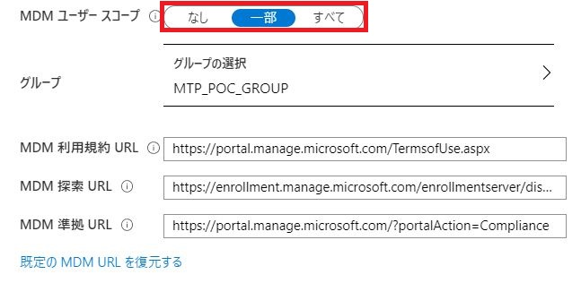
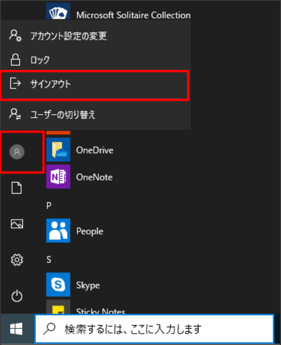

# Windows 10 デバイスの管理

## Windows 10 デバイスの登録準備
まずはデバイスの自動登録設定を行います。これはWindows10デバイスをAzure ADに登録した際に、同時にIntuneにも登録する設定であり、
Windows10デバイスをMDMを利用してモダン管理する場合、必須の設定となります。

1) [Intune 管理ダッシュボード](https://portal.azure.com/#blade/Microsoft_Intune_DeviceSettings/ExtensionLandingBlade/) に全体管理者でサインインします
2) [デバイスの登録] - [Windows の登録] - [自動登録] をクリックします
3) "MDM ユーザー スコープ" および "MAM ユーザー スコープ" で [一部] を選択し、PoC ユーザー グループを指定し、[保存] をクリックします
  

## Windows Hello for Businessの有効化（オプション）
次にWindowsにパスワードでなく、PIN（暗証番号）または生体認証（顔または指紋）でログインできるように、Windows Hello for Businessを有効化します。
この設定を行うことにより、デバイスへのログインが簡単になるだけでなく、パスワードがネットワークを流れなくなるため、セキュリティも向上するため、
ぜひご利用することをお勧めします。

1) [Intune 管理ダッシュボード](https://portal.azure.com/#blade/Microsoft_Intune_DeviceSettings/ExtensionLandingBlade/) に全体管理者でサインインします
2) [デバイスの登録] - [Windows の登録] - [Windows Hello for Business] をクリックします
3) 以下の通り設定を行い、[保存] をクリックします
  

## Windows 10 デバイスの登録
Windows 10デバイスに管理者権限のあるアカウントでログインし、以下の手順でAzure ADに登録します。

1) Windowsのスタートメニューから [設定] を開き、検索ボックスに「職場または学校へのアクセス」と入力し、表示された候補をクリックします。

2) [接続] ボタンをクリックします

3) [このデバイスをAzure Active Directoryに参加させる] をクリックします
  

4) Azure ADのアカウント（Office365にサインインするときのアカウント）を入力し、[次へ] をクリックします
  

5) パスワードを入力し、[次へ] をクリックします
  

6) [参加する] をクリックします
  

7) [完了] をクリックして画面を閉じます。
  

## Windows 10 デバイスの登録
これまでの手順で、デバイスがAzure ADに登録され、Azure ADのアカウントでデバイスにサインインできるようになりました。

1) Windowsのスタートメニューで ユーザーのアイコンをクリックし、 [サインアウト] をクリックします。

2) サインイン画面で、左下の [ほかのユーザー] をクリックし、Azure ADのアカウント・パスワードを入力しサインインします。

＜Windows Hello for Businessを有効にしている場合、以下の手順3～5の手順が必要となります。＞

3) 右下の [PINのセットアップ] をクリックします。環境によってはこの後に多要素認証を要求されるため、画面の指示に従って認証してください。

4) 任意のPINを入力し、 [OK] をクリックします。

5) PINの設定が完了したら、 [OK] をクリックします。

6) デスクトップが表示されたらEdgeを立ち上げ、https://portal.office.com にアクセスしてください。
認証を求められることなく、シングルサインオンでアクセスが出来たかと思います。
デバイスにログインする際にAzure ADの認証が既に完了しているため、このような動きとなります。

